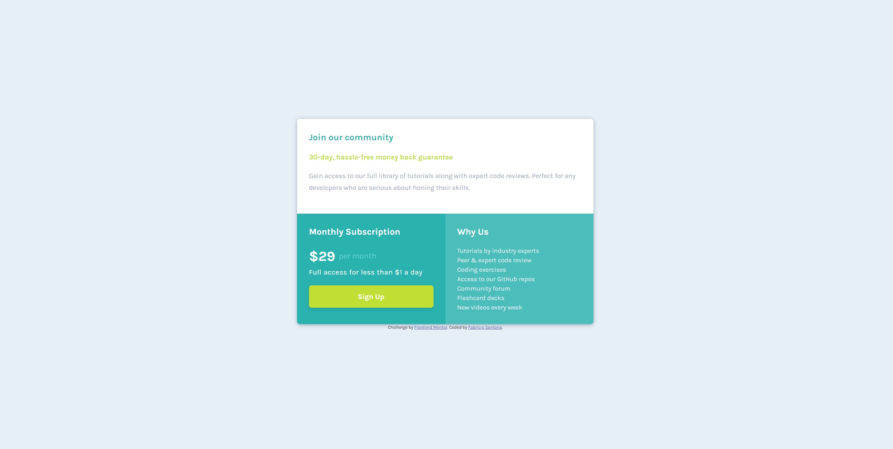

# Frontend Mentor - Single price grid component solution

This is a solution to the [Single price grid component challenge on Frontend Mentor](https://www.frontendmentor.io/challenges/single-price-grid-component-5ce41129d0ff452fec5abbbc). Frontend Mentor challenges help you improve your coding skills by building realistic projects. 

## Table of contents

- [Overview](#overview)
  - [The challenge](#the-challenge)
  - [Screenshot](#screenshot)
  - [Links](#links)
- [My process](#my-process)
  - [Built with](#built-with)
  - [Continued development](#continued-development)
  - [Useful resources](#useful-resources)
- [Author](#author)
- [Acknowledgments](#acknowledgments)

**Note: Delete this note and update the table of contents based on what sections you keep.**

## Overview

### The challenge

Users should be able to:

- View the optimal layout for the component depending on their device's screen size
- See a hover state on desktop for the Sign Up call-to-action

### Screenshot

### Links

- Live Site URL: [GitHub pages](https://fabsantana.github.io/Single-Price-Grid/)

## My process

### Built with

- Semantic HTML5 markup
- CSS custom properties
- Flexbox
- Mobile-first workflow

### Continued development

Still getting comfortable with media queries and perfecting it. Also some of the colors and fonts aren't perfect but their close enough.

### Useful resources

- [MDN Web Docs](https://developer.mozilla.org/en-US/) - this may as well be your home page
- [CSS-Tricks](https://www.css-tricks.com) - I love this website and you should use it. It really helped me out with understanding flexbox and media queries.

## Author

- Frontend Mentor - [@fabsnta](https://www.frontendmentor.io/profile/fabsnta)
- LinkedIn - [@santanafabricio](https://www.linkedin.com/in/santanafabricio/)

## Acknowledgments

Thanks as always to google and css-tricks.com lol
